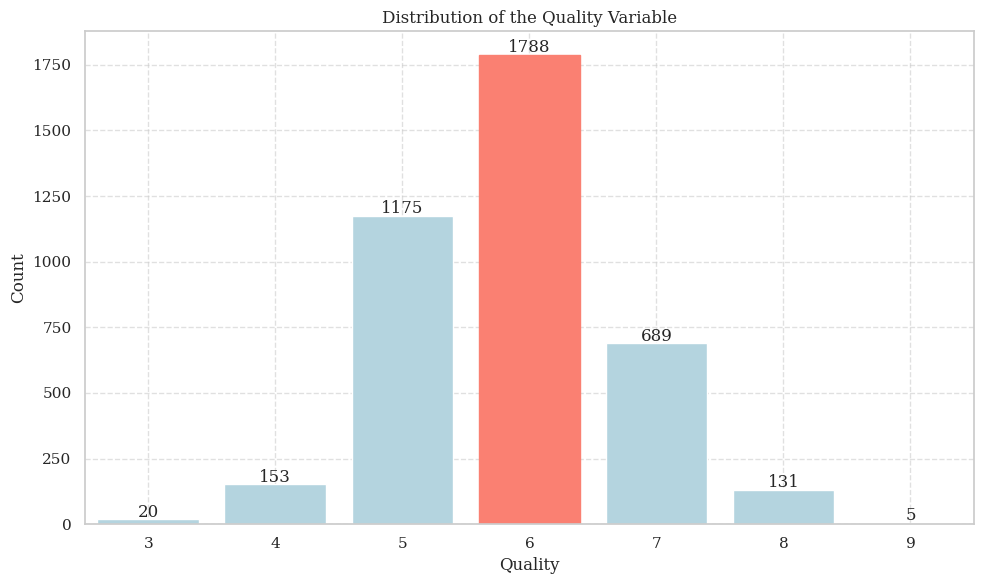
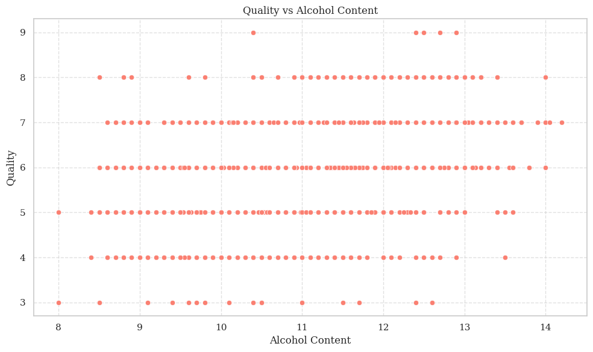
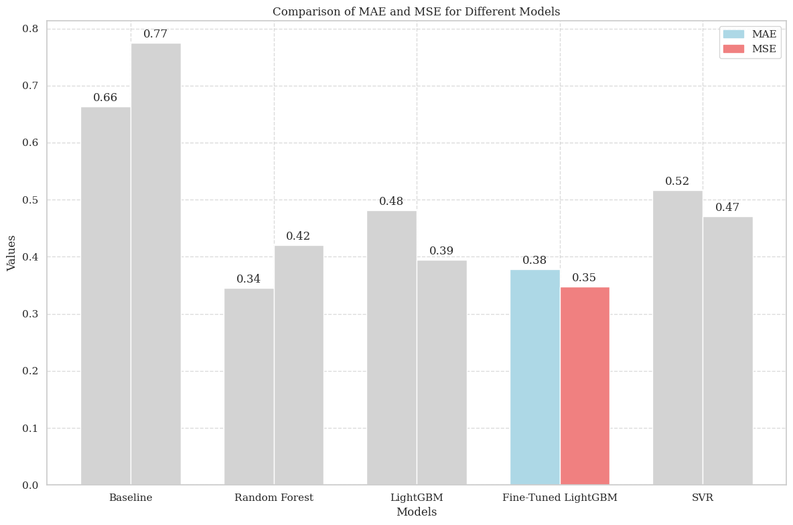

# Wine Quality Prediction

> Dataset used: **[Wine Quality Dataset](datasets/raw/)**  
> Notebooks: **[Visualizations](https://nbviewer.org/github/trigeminal/wine-quality-prediction/blob/main/notebooks/visualizations.ipynb) | [Models](https://nbviewer.org/github/trigeminal/wine-quality-prediction/blob/main/notebooks/models.ipynb)**

Predicts wine quality using a fine-tuned LightGBM model. It includes data preprocessing, model training, and evaluation, with experiment tracking and model management using MLflow.

## Features

- Data loading and preprocessing
- Model training using LightGBM
- Model evaluation with MAE and MSE metrics
- Experiment tracking and model management using **MLflow**

## Project Structure

- `data_loader.py`: Functions for loading and preprocessing the data.
- `model.py`: Function for defining the LightGBM model.
- `train.py`: Function for training the model and logging experiments with MLflow.
- `config.py`: Configuration file with hyperparameters and settings.
- `main.py`: Main script for running the entire pipeline.

## Visualizations

### Distribution of the Target Variable

**Insights**
- The mofe frequent wine quality ratings are 5, 6, and 7.
- The distribution of quality ratings is not symmetrical, it leans slightly to the right. This means there are more ratings on the higher end of the quality scale than on the lower end.

### Alcohol vs. Volatile Acidity by Wine Quality

**Insights**

- The graph suggests that alcohol content is sinificant factor in determining wine quality, with higher alcohol content wines generally having higher quality ratings.

### Comparison of MAE and MSE for Different Models

**Insights**

- The LightGBM model has the lowest MAE and MSE values, indicating that it is the best model for predicting wine quality.

## License

This project is licensed under the Apache License, Version 2.0 - see the [LICENSE](LICENSE) file for details.

    
###### To God be the glory.

